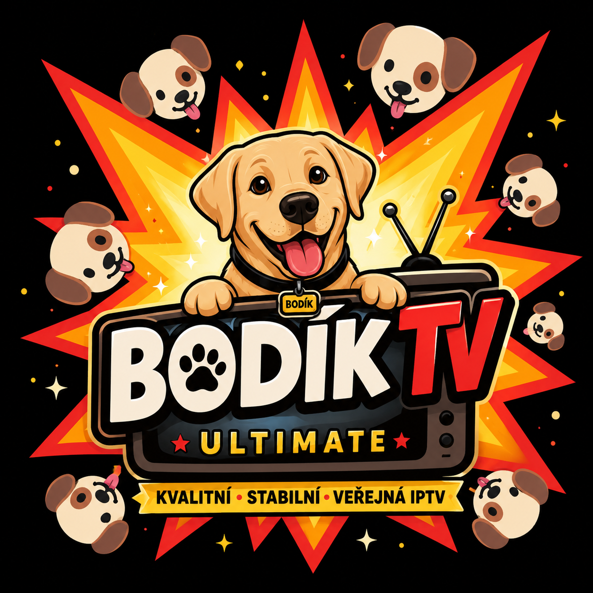

# 📺 Bondik TV Ultimate

<p align="center">
  
</p>

<p align="center">
  <strong>Quality before quantity.</strong><br>
  Open • Free • Community • Verified IPTV
</p>

<p align="center">


</p>

---

## 🌍 Welcome

**Bondik TV Ultimate** is a free and open-source IPTV playlist project focused on verified public streams, simple playlists and transparent quality control.

The current priority is **high-quality CZ/SK coverage**, not the highest possible channel count.

A working stream is not automatically trusted.  
A trusted testing stream is not automatically stable.

---

## ▶️ Quick Start

The main public playlist is:

```text
https://raw.githubusercontent.com/MichalDuffs/Bondik-TV-Ultimate/main/playlists/ultimate.m3u
```

Paste the URL into a compatible IPTV player.

Public playlists are generated from channels that have reached **stable** status. Testing candidates stay out of the public playlist until they pass the quality process.

- ⭐ [Ultimate playlist](playlists/ultimate.m3u)
- 🌍 [Country playlists](playlists/countries/)
- 🎬 [Category playlists](playlists/categories/)
- 📡 [Provider playlists](playlists/providers/)

---

## 🛡️ Quality Pipeline

```text
Public M3U sources
        ↓
M3U Hunter v0.9
        ↓
Candidate Gate v0.5.1
        ↓
Candidate ranking / audit
BAGTOP v1.0
        ↓
Manual provenance review
        ↓
AUTO-PROMOTION v1.1
        ↓
status=testing
        ↓
Testing Promotion Gate v0.7.1
        ↓
3 counted passes / minimum 24h gap
        ↓
Manual stable review
        ↓
STABLE PROMOTION v1.0
        ↓
status=stable
        ↓
Playlist Generator
        ↓
Public Bondik TV playlists
```

No candidate moves directly from discovery into the stable public playlist.

Automation helps us find, test and organize channels — it does **not** bypass human quality control.

---

## 🚜 Tooling

- 🔎 **M3U Hunter v0.9** — bulk discovery, country filtering, deep HLS verification and history
- 🚦 **Candidate Gate v0.5.1** — scoring, deduplication and priority / review / parking buckets
- 🚜 **BAGTOP v1.0** — quality ranking, diversity controls, category-family caps, full selection audit and run manifest
- 🛡️ **AUTO-PROMOTION v1.1** — provenance and risk gates before a candidate can enter testing
- 🧪 **Testing Promotion Gate v0.7.1** — spaced health passes with reset protection
- ✅ **STABLE PROMOTION v1.0** — controlled human-approved move from testing to stable
- 📡 **Stream health monitoring** — scheduled checks, outage streaks, recovery detection and issue automation
- 📅 **EPG tooling** — source validation, monitoring and maintenance planning
- 🤖 **GitHub Actions CI** — tests, metadata validation and playlist synchronization on every push / PR

The checker suite contains **300+ automated regression tests**, and CI validates the repository before changes are considered healthy.

---

## ✨ Features

- ⭐ Stable-only Ultimate playlist
- 🌍 Country playlists
- 🎬 Category playlists
- 📡 Provider playlists
- 📅 EPG support
- 🔎 Automated stream discovery
- 🛡️ Provenance and risk gates
- 🧪 Testing → stable lifecycle
- 📊 Auditable candidate ranking
- ❤️ Community driven
- 🚀 Free and open source

---

## 📂 Repository Structure

```text
assets/        branding and graphics
channels/      source-of-truth channel metadata
docs/          project documentation
epg/           EPG configuration and data
playlists/     generated public playlists
tools/         discovery, QC, promotion and generator tools
.github/       CI and scheduled automation
```

`channels/channels.yaml` is the central source of truth. Public playlists are generated from it.

---

## 📅 EPG & Stream Health

Supported channels can include Electronic Program Guide metadata.

The project also contains scheduled stream and EPG monitoring, retry protection, failure history and maintenance tooling so temporary outages do not automatically become permanent decisions.

---

## 📱 Supported Platforms

M3U playlists can be used with compatible players on platforms such as:

- Android / Android TV
- Windows
- Linux
- macOS
- iPhone / iPad / Apple TV
- LG webOS
- Samsung Tizen
- Fire TV

Player support depends on the application and stream format.

---

## 🗺️ Project Status

The core discovery and quality-control pipeline is already in place. Current work focuses on:

- 🇨🇿 expanding verified Czech coverage
- 🇸🇰 expanding verified Slovak coverage
- 📅 improving CZ/SK EPG mappings
- 🖼️ improving channel logos and metadata
- ✅ exercising the full production testing → stable lifecycle
- 📚 keeping documentation aligned with the tooling

For the detailed plan see [ROADMAP.md](ROADMAP.md).  
For recent changes see [CHANGELOG.md](CHANGELOG.md).

---

## 🦮 Naše filozofie

Nevytváříme projekt pro zisk.

Vytváříme projekt, který bychom sami chtěli používat.

**Open Source. Zdarma. Komunitní. S respektem k autorům obsahu.**

> **Když to přehraje Bondík, přehraje to každý.**

---

## 🤝 Contributing

Contributions are welcome — especially verified stream fixes, EPG improvements, documentation and reproducible bug reports.

Please read:

- [CONTRIBUTING.md](.github/CONTRIBUTING.md)
- [CODE_OF_CONDUCT.md](.github/CODE_OF_CONDUCT.md)

---

## ℹ️ Content Notice

Bondik TV Ultimate does not host television or video content. The project organizes playlist metadata and references publicly reachable stream URLs. Availability, ownership and distribution rights remain with the respective providers and rights holders.

---

## 📜 License

This project is licensed under the [MIT License](LICENSE).

---

## ❤️ Special Thanks

Thanks to everyone who supports the project and helps improve it.

Special appreciation goes to our four-legged quality inspector:

🐾 **Bondík — Chief Quality Officer (CQO)** 🦮

<p align="center">
  Made with ❤️ by the Open Source community.<br>
  Tested with 🐾 by Bondík.
</p>

---

⭐ Dej projektu hvězdičku.  
🍴 Forkni projekt.  
🤝 Přispěj.  
📢 Sdílej Bondik TV Ultimate.  
🦮 Staň se členem Bondik komunity.

### 🦮 Bondík říká:

> „Nefunguje nějaký kanál? Nevadí. Pošli Pull Request. Já zatím pohlídám buřty.“

🐶🔥🌭
